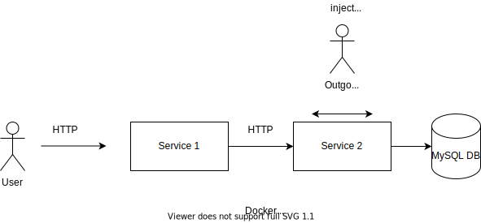

# PyCon Australia 2021 Materials

This repository contains materials for my talk [Planning for Failure using Chaos Engineering](https://2021.pycon.org.au/program/qbwrzj/).

You can find the slides (PDF) [here](./slides.pdf).

## Reproducing the Demo

You will need Docker Desktop installed and run this on a Linux system. One easy to do so might be create a fork of the repo 
and then use [GitHub workspaces](https://github.com/features/codespaces).





Build images:

```
$ cd demo-system
$ docker-compose build
```

Run services:

```
$ bash start_services.sh
```

Make a request and time it:

```
$ <repository root>
$ time curl 127.0.0.1:8000
<h1>Data</h1><p><table><tr><td>joe</td><td>cool</td></tr></table></p>
real    0m0.021s
user    0m0.007s
sys     0m0.004s
```

Inject fault:

```
$ <repo root>
$ python inject_latency.py 
```

Make a request and time it:

```
$ time curl 127.0.0.1:8000
<h1>Data</h1><p><table><tr><td>joe</td><td>cool</td></tr></table></p>
real    *0m6.419s*
user    0m0.005s
sys     0m0.005s
```

Introduce timeout:

```
$ time curl -I 127.0.0.1:8000?pyconau-demo=true
HTTP/1.1 500 INTERNAL SERVER ERROR
Server: gunicorn/20.0.4
Date: Thu, 09 Sep 2021 01:06:02 GMT
Connection: close
Content-Type: text/html; charset=utf-8
Content-Length: 0


real    0m0.319s
user    0m0.007s
sys     0m0.004s
```

Remove fault:

```
$ python remove_latency.py 
```

Now make a request again, including the timeout:

```
$ time curl -I 127.0.0.1:8000?pyconau-demo=true
HTTP/1.1 200 OK
Server: gunicorn/20.0.4
Date: Thu, 09 Sep 2021 01:06:51 GMT
Connection: close
Content-Type: text/html; charset=utf-8
Content-Length: 69

real    0m0.023s
user    0m0.003s
sys     0m0.006s
```

Cleanup:

```
$ cd demo-system
$ bash cleanup.sh

```
## Resources

### Books

- [Release It!]() - Chapter 17, "Chaos Engineering"
- [The Chaos Engineering Book](https://www.verica.io/blog/the-chaos-engineering-book/)
- [Chaos Engineering](https://www.oreilly.com/library/view/chaos-engineering/9781492043850/) by Casey Rosenthal, Nora Jones

### Articles

- [Principles of Chaos Engineering](https://principlesofchaos.org/)
- [Failure Injection Testing](https://netflixtechblog.com/fit-failure-injection-testing-35d8e2a9bb2)
- [Chaos Engineering, history, timeline](https://www.gremlin.com/community/tutorials/chaos-engineering-the-history-principles-and-practice/)

## Talks

[Identifyingn Hidden Dependencies](https://www.usenix.org/conference/srecon20americas/presentation/fong-jones)

- Continuous verification
- Test your recover procedures
- Practice controlled experiments

[Why SREs can't afford to NOT do Chaos Engineering](https://www.usenix.org/conference/srecon20americas/presentation/pawlikowski)


[Cloudy with a chance of chaos](https://www.usenix.org/conference/srecon20americas/presentation/yakomin)

### Tools

- [Emulating wide area network delays](https://wiki.linuxfoundation.org/networking/netem#emulating_wide_area_network_delays)
- [Tor is a great sysadmin tool](https://www.jamieweb.net/blog/tor-is-a-great-sysadmin-tool/)
- [Use Traffic Control to Simulate Network Chaos in Bare metal & Kubernetes](https://songrgg.github.io/operation/use-traffic-control-simulate-network-chaos/)
- [Using Linux Traffic Control](https://netbeez.net/blog/how-to-use-the-linux-traffic-control/)

## Community

- [Google group](https://groups.google.com/forum/#!forum/chaos-community)
